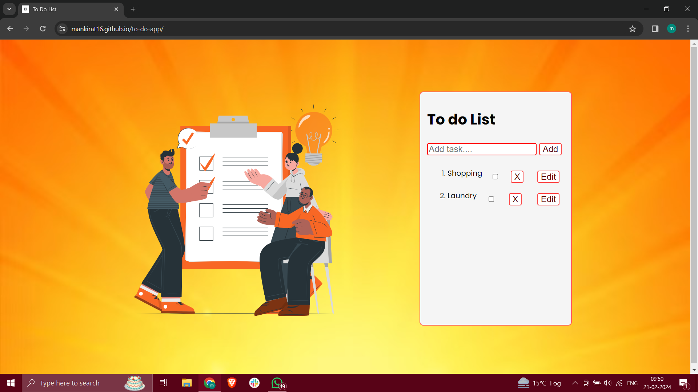

# To-Do App

Welcome to the To-Do App! This simple application allows you to manage your tasks effectively. You can add, remove, and mark tasks as completed, all in one convenient interface.

## Features

- Add tasks: Enter a task in the input field and press the "Add Task" button to add it to your list.
- Remove tasks: Click on the "Remove" button next to a task to remove it from your list.
- Mark tasks as completed: Use the checkbox next to each task to mark it as completed. Completed tasks will have a line-through style.
- Edit tasks: Click on the "Edit" button to edit the text of a task.

## Getting Started

To use the To-Do App, follow these steps:

1. Clone this repository to your local machine.
2. Open the index.html file in your web browser.
3. Start managing your tasks!

## Technologies Used

- HTML
- CSS
- JavaScript

## Demo

## Acknowledgments

Special thanks to Aarshiya for the inspiration and guidance in building this To-Do App.
